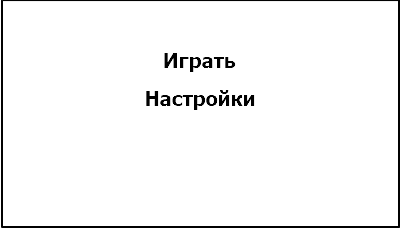

<h1>Спецификации разработки ПО “8bit-Tanks”</h1>
<h2>1 Введение</h2>
<h2>1.1 Цель</h2>

Данный документ содержит детали реализации требований к проекту”8Bit - Tanks”

<h3>1.2	Обзор системы </h3>

Данный продукт представляет собой однопользовательскую игру. Он позволяет игроку создать игровой сеанс для игры с ботами. Игра происходит в реальном времени, игрок упрваляет танком. Цель игры уничтожить всех противников или уничтожить их базу. В конце игры пользователю будет предоставлена статистика завершенного игрового сеанса. Игра будет также предоставлять пользователю возможность настроек параметров сеанса.

  
<h3>1.3 Карта документа</h3>

В данном документе содержатся информациях об основных решениях, которые будут использоваться при разработке проекта. В разделе 3 содержится информация о взаимодействии программ игроков, общая информация о классах приложения, диаграмма последовательности.

<h3>1.3 Характеристики пользователей</h3>

Данное приложение рассчитано на пользователей любого уровня образования и с минимальным уровнем владения ПК. Также стоит отметить, что оно требует наличие минимальных знаний игры.

<h3>1.4	Термины и сокращения </h3>

Для обозначения непосредственно игрового процесса между двумя игроками используется термин «Игровой сеанс».

<h2>2 Обзор системы</h2>
<h3>2.1 Допущения</h3>

Количество ботов ограничено пятью.

<h3>2.2 Ограничения</h3>

<h4>2.3 Системная среда</h4>

Создаваемый программный продукт будет работать в операционной системе Windows 10.

<h4>2.4 Методология разработки</h4>

Для создания данного программного продукта была выбрана объектно-ориентированная методология разработки ПО.

<h4>2.5 Риски и опасные места</h4>

Не выявлены.

<h2>3 Архитектура</h2>
<h4>3.1 Обзор</h4>

Особенности архитектуры создаваемого приложения обусловлены объектно-ориентированной парадигмой разработки.

<h4>3.2 Алгоритм действия ботов</h4>

Для симуляции  поведения ботов был выбран алгоритмический вариант.
Алгоритм движения:
При старте игрового сеанса будет случайно выбрано одно из доступных направлений движения. В первые несколько минут игры движения влево и право будут более вероятными. После прохождения определённого времени вероятность движения вниз будет увеличивается. При продолжительном движении  в одном направлении будет появляется вероятность смены направления, чем дольше происходит движение,  тем больше вероятность.
Алгоритм выстрела:
Если между ботом и игроком или базой игрока нет препятствий бот стреляет.

<h4>3.3 Классы</h4>

В соответствии с парадигмой объектно-ориентированного программирования за каждую важную деталь создаваемой игры отвечает отдельный класс. Ниже приведены все классы с их методами которые используются или находятся на стадии разработки:
Класс Tank – класс для работы с танками ботов и игрока.
Класс Board – класс для работы с неподвижными элементами карты.
Класс Bullet – класс для работы со снарядами.
Класс AI - класс для модклирования поведения противников.
Класс Enemys - класс для работы со всеми противниками.

<h2>4 Интерфейс пользователя</h2>

 Создаваемый программный продукт будет иметь классический графический пользовательский интерфейс. При запуске пользователю предоставлено меню, в котором он сможет выбрать пункт “Настройки” ,“Играть”. В пункте “Настройки”  пользователь сможет выбрать настройки игрового сеанса. В пункте “Играть” пользователь сможет начать игру с ранее установленными настройками. В ходе игры пользователь сможет поставить игру на паузу, и возобновить её , так же будет предоставляться информация о текущем сеансе.  Оформление меню и самой игры минималистичное, на фоне допускаются картинки, соответсвующие общему оформлению игры. 

Рисунок 1 - начальное меню

Игровое поле будет разделено на две части. Справочная информация о текущем игровом сеансе, расположенная в правой части окна , а именно время игры, количество противников, игровой счёт, количество жизней. 2D карта, на которой будут происходить основные действия, такие как взаимодействие игровых моделей игрока и его противников друг с другом и ландшафтом, передвижение игровых моделей.

Рисунок 2 - игравое окно

В настройках можно будет изменить игровые параметры, такие как количество жизней игрока и противников, цвет модели игрока и его противников.
 

Рисунок 3 - настройки

