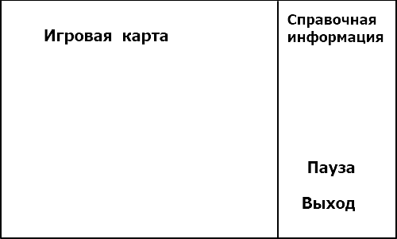
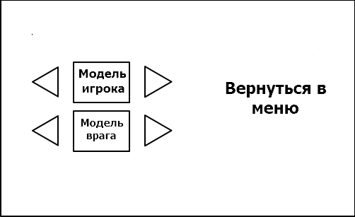

<h1>Требования к проекту “8bit-Tanks”</h1>
<h2>1 Введение</h2>

Игра “8bit-Tanks” — аркадная игра для одного игрока, заключающаяся в передвижении по карте, имеющей различные препятствия,  и уничтожении противников. Цель игры — уничтожить всех противников, не дав при этом уничтожить свою базу.

<h2>2 Требования пользователя</h2>

<h3>2.1 Программные интерфейсы</h3>

Разработка будет вестись с использованием языка программирования Java. Будут задействованы как стандартные библиотеки, так и сторонние, например, javafx. Разработка будет вестись в Intellij Idea.Основных программных продукты, используемые в процессе разработки:

  <ul>
 <li>
Среда разработки : Intellij Idea community edition 202.2
</li>
 <li>
Средства разработки : Java SE Development Kit 8u261
</li>
 <li>
Графическая библиотека : JavaFX 11.0.2
</li>
 </ul>
   
<h3>2.2 Интерфейс пользователя</h3>

Создаваемый программный продукт будет иметь графический пользовательский интерфейс. При запуске программы будет предоставлено меню, в котором пользователь выбрать один из предложенных пунктов ”Играть”, ”Выйти”, “Настройки”. Оформление меню и самой игры минималистичное, на фоне могут быть картинки, соответствующие общему оформлению игры.

Рисунок 1 - начальное меню

Игровое поле будет разделено на две части. Справочная информация о текущем игровом сеансе, расположенная в правой части окна , а именно время игры, количество противников, игровой счёт, количество жизней. 2D карта, на которой будут происходить основные действия, такие как взаимодействие игровых моделей игрока и его противников друг с другом и ландшафтом, передвижение игровых моделей.

Рисунок 2 - игравое окно

В настройках можно будет изменить игровые параметры, такие как игровая карта, цвет модели игрока и его противников, цветовую гаму программы.
 

Рисунок 3 - настройки

<h3>2.3 Характеристики пользователей</h3>

Данное приложение рассчитано на пользователей любого уровня образования и с минимальным уровнем владения ПК. Также стоит отметить, что оно требует наличие минимальных знаний игры.

<h3>2.4 Предположения и зависимости</h3>

На перечисленные в данном документе требования к создаваемому программному продукту могут влиять сроки, отведенные для разработки, а также новые идеи. .

<h2>3 Системные требования</h2>
  <ul>
 <li>
Частота процессора 1 ГГц
</li>
 <li>
Объем ОЗУ: 256 мегабайт
</li>
 <li>
Наличие клавиатуры
</li>
 <li>
Операционная система Microsoft Windows 7, 8, 10
</li>
 </ul>
<h3>3.1 Функциональные требования</h3>
<ul>
 <li>
Качественное оформление приложения, включающее в себя понятный пользовательский интерфейс, текстуры и анимацию.
</li>
 <li>
Наличие счетчика времени, очков. По окончании игры пользователям будет предоставлена статистика прошедшей партии, содержащая данные о времени, количестве набранных очков. Будет предложен выход в главное меню.
</li>
 <li>
Адекватная реакция приложения на различные ненормальные ситуации, такие как потеря сетевого подключения, различные сбои в работе приложения
</li>
 
<h3>3.2 Нефункциональные требования</h3>
<h4>3.2.1 Атрибуты качества</h4>

Для создаваемого продукта необходимы такие атрибуты, как стабильность работы, невысокая требовательность к ресурсам компьютера. Приложение не будет требовать никаких личных данных.Приложение будет располагаться локально. Приложение должно работать на ПК с любой операционной системой.

